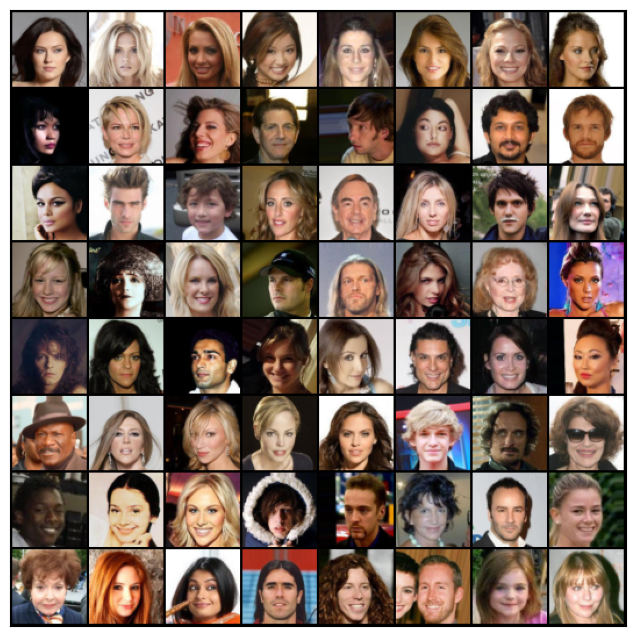

# celebGAN: Celebrity Face Generation with DCGANs

Welcome to celebGAN! This repository contains a Jupyter notebook for generating synthetic face images of celebrities using a Deep Convolutional Generative Adversarial Network (DCGAN).

## Original Data

This section showcases the original dataset of celebrity face images used in the project. 

## Usage

To generate synthetic face images, follow these steps:

1. Open the [Celeb_dcGans.ipynb](https://github.com/SYED-M-HUSSAIN/celebGAN-Celebrity-Face-Generation/blob/main/Celeb_dcgan.ipynb) notebook in Google Colab.
2. Click on the "Open in Colab" button at the top of the notebook.
3. Follow the instructions in the notebook to set up the necessary dependencies and runtime environment.
4. Execute the code cells in sequential order to train the DCGAN model and generate synthetic face images.
5. The generated images will be saved in the output directory.

Please note that the notebook assumes you have access to a dataset of celebrity face images. You can provide your own dataset or use publicly available datasets like the CelebA dataset.

## Dataset

To train the DCGAN model, you need a dataset of celebrity face images. You can obtain the CelebA dataset from the official website [here](https://www.kaggle.com/datasets/jessicali9530/celeba-dataset) or use any other suitable dataset of your choice.

Place the dataset in the appropriate location and update the file paths in the notebook accordingly.

## Contributing

Contributions to celebGAN are welcome! If you find any bugs or have suggestions for improvements, please open an issue or submit a pull request.

## License

This project is licensed under the MIT License. See the [LICENSE](LICENSE) file for more details.
